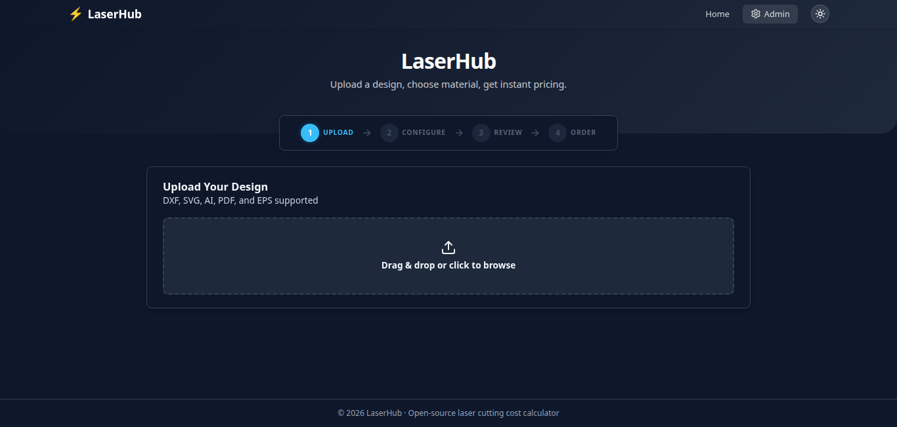
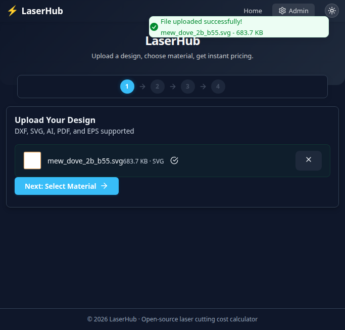
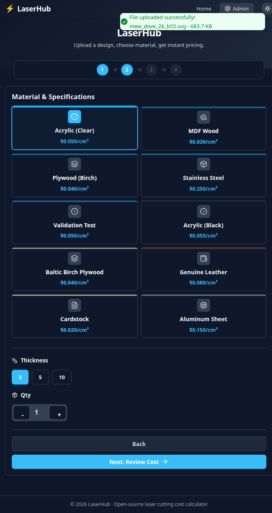
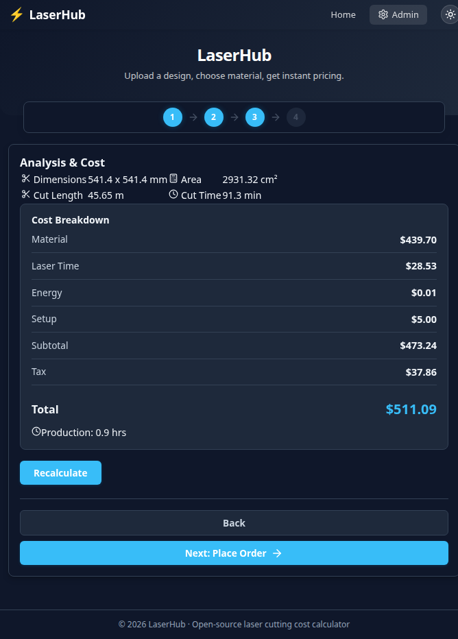
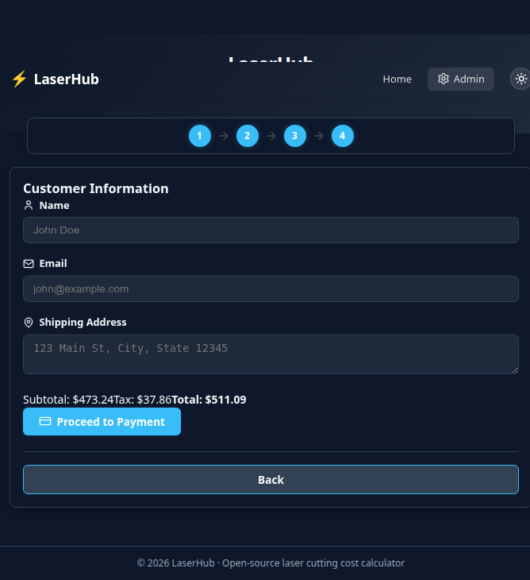
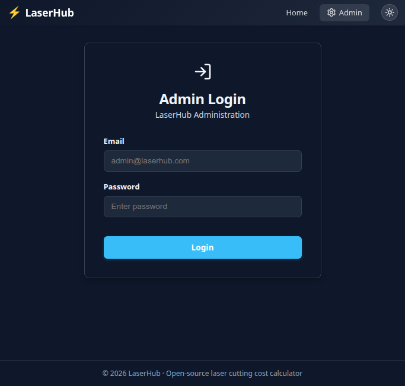
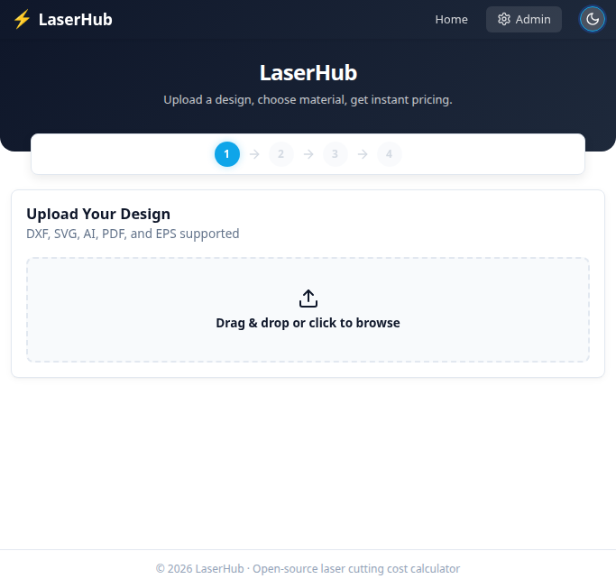

<div align="center">

# LaserHub

### Open-Source Laser Cutting Cost Calculator & Order Management Platform

[](https://opensource.org/licenses/Apache-2.0)
[](https://fastapi.tiangolo.com/)
[](https://reactjs.org/)
[](https://www.typescriptlang.org/)
[](https://www.python.org/)
[](https://vitejs.dev/)
[](https://www.sqlalchemy.org/)
[](https://stripe.com/)

**Upload vector files. Select materials. Get instant pricing. Place orders.**

A complete, production-ready platform for laser cutting businesses, CNC fabrication shops, and makerspaces to automate cost estimation, streamline order management, and accept online payments -- all from a single, self-hosted web application.

[Screenshots](#screenshots) | [Quick Start](#quick-start) | [Features](#features) | [API Docs](#api-documentation) | [Contributing](#contributing)

</div>

---

## Why LaserHub?

Running a laser cutting or CNC fabrication business means juggling file reviews, manual cost estimates, back-and-forth emails, and order tracking spreadsheets. **LaserHub eliminates all of that.**

- **Customers** upload DXF, SVG, AI, PDF, or EPS files and get an instant, transparent cost breakdown -- no waiting for quotes.
- **Shop owners** get a full admin dashboard with order management, material configuration, analytics, and payment processing baked in.
- **Developers** get a clean, modern codebase (FastAPI + React + TypeScript) that is easy to extend, self-host, and customize.

Whether you run a laser engraving side hustle or a full-scale fabrication facility, LaserHub gives you the tools to professionalize your workflow from day one.

---

## Screenshots

<div align="center">

### Homepage -- Upload Your Design



<br/><br/>

### File Uploaded -- Instant Analysis



<br/><br/>

### Material Selection -- Choose Your Material & Thickness



<br/><br/>

### Cost Breakdown -- Transparent Pricing



<br/><br/>

### Order Form -- Place Your Order



<br/><br/>

### Admin Login -- Secure Access



<br/><br/>

### Light Mode -- Fully Themed



</div>

---

## Features

### File Upload & Geometric Analysis
- Drag-and-drop upload supporting **DXF, SVG, AI, PDF, and EPS** vector file formats
- Automatic extraction of cut path length, bounding box area, and geometric complexity
- Powered by `ezdxf`, `svglib`, `pypdf`, and `pdfminer.six` for reliable parsing
- File size limits and rate limiting to prevent abuse

### Smart Cost Calculation Engine
- Fully configurable cost formula combining **material cost + laser time + energy consumption + setup fee + tax**
- Per-material, per-thickness pricing with admin-configurable rates
- Adjustable laser power (watts), cut speed (mm/min), and electricity rate
- Real-time cost preview as users change material or thickness

### Material Management
- Admin-configurable material library (Acrylic, Wood/MDF, Plywood, Leather, Metal, and more)
- Per-material thickness options with individual pricing
- Visual color swatches for each material
- Add, edit, or remove materials without touching code

### Order Management & Tracking
- Complete order lifecycle: created, confirmed, in-progress, completed, shipped
- Order number generation, customer details, and file association
- CSV export for bookkeeping and reporting
- Email notifications via configurable SMTP

### Payment Integration
- **Stripe** payment processing with Payment Intents API
- Webhook handling for reliable payment confirmation
- Configurable currency and payment settings from the admin panel

### Admin Dashboard
- Secure admin authentication with JWT tokens
- Order analytics and status overview with **Recharts** visualizations
- Material and pricing configuration UI
- Payment and shop settings management

### Dark/Light Mode
- Full dark and light theme support across the entire application
- System preference detection with manual toggle
- Consistent styling with CSS custom properties

### Progressive Web App (PWA)
- Installable on desktop and mobile devices via `vite-plugin-pwa`
- Offline-capable shell for fast repeat visits
- Responsive design that works on any screen size

### Security & Rate Limiting
- Request rate limiting via `slowapi` (configurable per-minute and per-hour limits)
- File upload size restrictions (default 50 MB max)
- API key authentication support for external integrations
- Structured logging with `structlog` for audit trails
- CORS configuration with trusted origins

---

## Tech Stack

| Layer | Technology | Purpose |
|-------|-----------|---------|
| **Frontend** | React 18, TypeScript, Vite 5 | Single-page application with fast HMR |
| **State Management** | Zustand | Lightweight, hook-based global state |
| **UI Components** | Lucide React, Sonner (toasts) | Icons and notification system |
| **Charts** | Recharts | Admin analytics and visualizations |
| **Payments (Client)** | Stripe.js, React Stripe | Secure client-side payment elements |
| **Backend** | FastAPI (Python 3.13) | Async REST API with auto-generated docs |
| **ORM** | SQLAlchemy 2.0 (async) + Alembic | Database models and migrations |
| **Database** | SQLite (dev) / PostgreSQL (prod) | Persistent data storage |
| **File Parsing** | ezdxf, svglib, pypdf, pdfminer.six | DXF, SVG, PDF vector file analysis |
| **Payments (Server)** | Stripe Python SDK | Payment intent creation and webhooks |
| **Auth** | python-jose (JWT), passlib (bcrypt) | Token-based authentication |
| **Email** | aiosmtplib, Jinja2 templates | Transactional email notifications |
| **Rate Limiting** | slowapi | Request throttling and abuse prevention |
| **Logging** | structlog | Structured, machine-readable logs |
| **Testing** | Pytest, Vitest, Playwright | Backend, frontend, and E2E tests |

---

## Quick Start

### Prerequisites

- **Python 3.13+** (with `pip`)
- **Node.js 18+** (with `npm`)
- Git

### 1. Clone the Repository

```bash
git clone https://github.com/hemangjoshi37a/LaserHub.git
cd LaserHub
```

### 2. Backend Setup

```bash
cd backend

# Create and activate virtual environment
python -m venv venv
source venv/bin/activate        # Linux / macOS
# venv\Scripts\activate          # Windows

# Install dependencies
pip install -r requirements.txt

# Create environment file
cp .env.example .env
# Edit .env with your Stripe keys, admin credentials, etc.

# Run database migrations
alembic upgrade head

# Start the backend server
uvicorn app.main:app --reload --port 8000
```

### 3. Frontend Setup

```bash
cd frontend

# Install dependencies
npm install

# Create environment file
cp .env.example .env
# Edit .env with your API URL and Stripe public key

# Start the development server
npm run dev
```

### 4. Seed the Database (Optional)

Populate the database with default materials and thicknesses:

```bash
cd backend
python -m app.scripts.seed_db
```

### 5. Access the Application

| Service | URL |
|---------|-----|
| Frontend | [http://localhost:5173](http://localhost:5173) |
| Backend API | [http://localhost:8000](http://localhost:8000) |
| API Documentation (Swagger) | [http://localhost:8000/docs](http://localhost:8000/docs) |
| Admin Panel | [http://localhost:5173/admin](http://localhost:5173/admin) |

---

## Project Structure

```
LaserHub/
├── backend/                        # Python FastAPI server
│   ├── app/
│   │   ├── api/                    # API route handlers
│   │   │   ├── admin.py            # Admin endpoints (orders, settings)
│   │   │   ├── auth.py             # Authentication (login, register)
│   │   │   ├── calculate.py        # Cost calculation endpoint
│   │   │   ├── materials.py        # Material CRUD
│   │   │   ├── orders.py           # Order management
│   │   │   ├── payment.py          # Stripe payment intents & webhooks
│   │   │   └── upload.py           # File upload & parsing
│   │   ├── core/                   # Configuration, security, database
│   │   ├── models/                 # SQLAlchemy ORM models
│   │   ├── services/               # Business logic (cost calculator, email)
│   │   ├── scripts/                # Utility scripts (database seeding)
│   │   └── utils/                  # File parsing helpers
│   ├── migrations/                 # Alembic database migrations
│   ├── templates/                  # Jinja2 email templates
│   ├── tests/                      # Pytest test suite
│   ├── requirements.txt
│   └── alembic.ini
├── frontend/                       # React + TypeScript SPA
│   ├── src/
│   │   ├── components/             # Reusable UI components
│   │   │   ├── FileUpload.tsx      # Drag-and-drop file upload
│   │   │   ├── MaterialSelector.tsx# Material & thickness picker
│   │   │   ├── CostDisplay.tsx     # Cost breakdown view
│   │   │   ├── OrderForm.tsx       # Customer order form
│   │   │   ├── AdminDashboard.tsx  # Admin overview panel
│   │   │   ├── AdminLogin.tsx      # Admin authentication
│   │   │   └── MaterialManager.tsx # Admin material CRUD
│   │   ├── pages/                  # Route-level page components
│   │   ├── services/               # API client layer
│   │   ├── store/                  # Zustand state management
│   │   └── test/                   # Vitest unit tests
│   ├── tests/                      # Playwright E2E tests
│   ├── package.json
│   ├── tsconfig.json
│   └── vite.config.ts
├── screenshots/                    # Application screenshots
├── docs/                           # Additional documentation
├── LICENSE                         # Apache 2.0
└── README.md
```

---

## Cost Calculation Formula

LaserHub uses a transparent, multi-factor pricing formula that shop owners can fully customize:

```
Total Cost = Material Cost + Laser Time Cost + Energy Cost + Setup Fee + Tax
```

### Material Cost

```
Material Cost = Bounding Area (cm²) x Material Rate (per cm² per mm thickness) x Thickness (mm)
```

### Laser Time & Energy Cost

```
Laser Time (min)  = Total Cut Path Length (mm) / Cut Speed (mm/min)
Energy Cost        = Laser Power (kW) x Time (hours) x Electricity Rate (per kWh)
```

### Configurable Parameters

| Parameter | Default | Description |
|-----------|---------|-------------|
| Laser Power | 60 W | Wattage of the laser cutter |
| Cut Speed | 500 mm/min | Default cutting speed |
| Electricity Rate | $0.12/kWh | Local electricity cost |
| Material Rates | Per-material | Configurable in admin panel |
| Tax Rate | Configurable | Applied to the subtotal |
| Setup Fee | Configurable | Flat fee per order |

All of these values can be adjusted from the admin dashboard or via environment variables -- no code changes required.

---

## API Documentation

LaserHub auto-generates interactive API documentation via FastAPI's built-in Swagger UI. Once the backend is running, visit:

- **Swagger UI**: [http://localhost:8000/docs](http://localhost:8000/docs)
- **ReDoc**: [http://localhost:8000/redoc](http://localhost:8000/redoc)

### Key Endpoints

| Method | Endpoint | Description |
|--------|----------|-------------|
| `POST` | `/api/upload` | Upload a vector file (DXF, SVG, AI, PDF, EPS) |
| `POST` | `/api/calculate` | Calculate laser cutting cost for a file + material |
| `GET` | `/api/materials` | List all available materials and thicknesses |
| `POST` | `/api/materials` | Add a new material (admin) |
| `PUT` | `/api/materials/{id}` | Update material pricing (admin) |
| `POST` | `/api/orders` | Create a new order |
| `GET` | `/api/orders/{id}` | Get order details |
| `POST` | `/api/payment/intent` | Create a Stripe payment intent |
| `POST` | `/api/payment/webhook` | Handle Stripe webhook events |
| `POST` | `/api/auth/login` | Authenticate and receive JWT token |
| `POST` | `/api/auth/register` | Register a new user account |
| `GET` | `/api/admin/orders` | List all orders (admin, with filters) |
| `PUT` | `/api/admin/orders/{id}` | Update order status (admin) |
| `GET` | `/api/admin/analytics` | Dashboard analytics data (admin) |

---

## Supported File Formats

| Format | Extension | Description | Parser |
|--------|-----------|-------------|--------|
| DXF | `.dxf` | AutoCAD Drawing Exchange Format | `ezdxf` |
| SVG | `.svg` | Scalable Vector Graphics | `svglib` |
| AI | `.ai` | Adobe Illustrator (PDF-based) | `pypdf` |
| PDF | `.pdf` | Portable Document Format (vector) | `pypdf` + `pdfminer.six` |
| EPS | `.eps` | Encapsulated PostScript | `Pillow` |

---

## Environment Variables

### Backend (`backend/.env`)

| Variable | Default | Description |
|----------|---------|-------------|
| `DATABASE_URL` | `sqlite+aiosqlite:///./laserhub.db` | Database connection string |
| `SECRET_KEY` | -- | JWT signing secret (change in production) |
| `ADMIN_EMAIL` | -- | Default admin account email |
| `ADMIN_PASSWORD` | -- | Default admin account password |
| `STRIPE_SECRET_KEY` | -- | Stripe secret API key |
| `STRIPE_PUBLIC_KEY` | -- | Stripe publishable key |
| `STRIPE_WEBHOOK_SECRET` | -- | Stripe webhook endpoint secret |
| `LASER_POWER_WATTS` | `60.0` | Laser cutter power in watts |
| `CUT_SPEED_MM_PER_MIN` | `500.0` | Default cutting speed |
| `ELECTRICITY_RATE` | `0.12` | Electricity cost per kWh |
| `FRONTEND_URL` | `http://localhost:5173` | CORS allowed origin |
| `SMTP_SERVER` | `localhost` | SMTP server for email notifications |
| `SMTP_PORT` | `1025` | SMTP server port |
| `SMTP_FROM_EMAIL` | `noreply@laserhub.com` | Sender email address |
| `RATE_LIMIT_PER_MINUTE` | `60` | API requests per minute (unauthenticated) |
| `MAX_FILE_SIZE_MB` | `50` | Maximum upload file size |
| `LOG_LEVEL` | `INFO` | Application log level |

### Frontend (`frontend/.env`)

| Variable | Default | Description |
|----------|---------|-------------|
| `VITE_API_URL` | `http://localhost:8000/api` | Backend API base URL |
| `VITE_STRIPE_PUBLIC_KEY` | -- | Stripe publishable key (client-side) |

---

## Contributing

Contributions are welcome! Whether it is a bug report, feature request, documentation improvement, or code contribution -- every bit helps.

### How to Contribute

1. **Fork** the repository
2. **Create** a feature branch: `git checkout -b feature/your-feature-name`
3. **Commit** your changes: `git commit -m "feat: add amazing feature"`
4. **Push** to your fork: `git push origin feature/your-feature-name`
5. **Open** a Pull Request against `main`

### Ideas for Contribution

- Add support for additional vector file formats (e.g., STEP, IGES)
- Implement Razorpay or other regional payment gateways
- Add Google OAuth one-tap sign-in
- Build a 3D design preview with Three.js and orbit controls
- Add multi-language / internationalization support
- Write more unit and integration tests
- Improve accessibility (WCAG compliance)
- Add Docker and Docker Compose deployment configuration

Please read the [Contributing Guide](CONTRIBUTING.md) and [Code of Conduct](CODE_OF_CONDUCT.md) before submitting.

---

## License

This project is licensed under the **Apache License 2.0** -- see the [LICENSE](LICENSE) file for details.

You are free to use, modify, and distribute this software for both personal and commercial purposes.

---

## Contact

**Hemang Joshi** -- Founder, [hjLabs.in](https://hjlabs.in)

[](mailto:hemangjoshi37a@gmail.com)
[](https://www.linkedin.com/in/hemang-joshi-046746aa)
[](https://www.youtube.com/@HemangJoshi)
[](https://wa.me/917016525813)
[](https://t.me/hjlabs)

**hjLabs.in** -- Industrial Automation | AI/ML | IoT | SEO Tools

Serving **15+ countries** with a **4.9 Google rating**

[](https://hjlabs.in)

---

<div align="center">

**Built for the laser cutting, CNC fabrication, and makerspace community.**

If LaserHub helps your business, consider giving it a star on GitHub.

</div>
